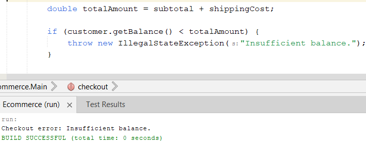

# E-Commerce System - Java OOP

This project is a simple **Java-based e-commerce simulation**. It demonstrates **Object-Oriented Programming (OOP)** principles such as abstraction, inheritance, interfaces, encapsulation, and exception handling.

---

##  Features

- Define products with:
  - Name, Price, Quantity
  - Products that have expiry (e.g., Cheese)
  - Products that have shipping requirements (e.g., TV)
- Add products to a cart with specified quantity
- Perform checkout:
  - Validate product availability and expiry
  - Calculate subtotal, shipping fees, total cost
  - Deduct from customer balance
  - Print receipt and shipping notice


---

##  Assumptions


- Expiry is checked using the current system date
- If a product is out of stock or expired, checkout fails
- If customer balance is insufficient, checkout fails
- Products that do not require shipping return `0.0` as weight


---

##  Example Code

```java

Product cheese = new ExpirableProduct("Cheese", 100, 5, LocalDate.of(2025, 7, 20), 0.4);
Product biscuits = new ExpirableProduct("Biscuits", 150, 3, LocalDate.of(2025, 7, 10), 0.7);
Product tv = new NonExpirableProduct("TV", 300, 2, true, 5.0);
Product scratchCard = new NonExpirableProduct("Scratch Card", 50, 10, false, 0.0);

Customer customer = new Customer("Ali", 50000);

Cart cart = new Cart();

cart.addProduct(cheese, 2);
cart.addProduct(biscuits, 1);
cart.addProduct(tv, 1);
cart.addProduct(scratchCard, 1);

checkout(customer, cart);
```

###  Console Output


### Insufficient balance case



### Empty cart case


### Expired case


### Not enough stock case


